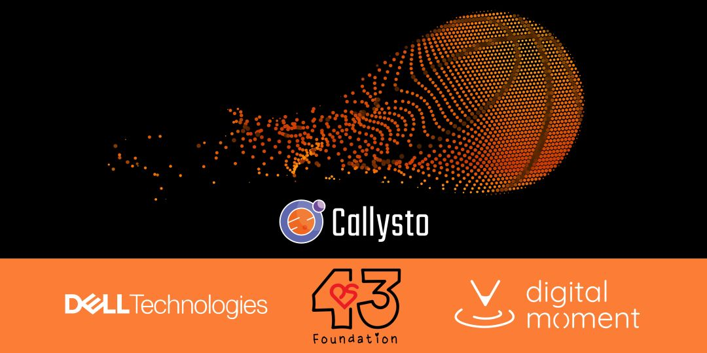

# Data Dunkers Program

Data Dunkers is an innovative basketball and data science learning experience for students in Grades 5-12. Students learn foundational data science skills through basketball statistics in a fun and inclusive environment.

## Resources

The program consists of learning activities designed to explore how to find meaning in data, primarily using open data from the NBA and WNBA. Students engage in data analysis by defining a question, collecting, cleaning, and analyzing data, and effectively communicating results. Beyond this, the initiative serves as a launchpad for global competencies, such as critical thinking and problem solving, and discovering career pathways within the realm of data science.

* [Pascal Siakam Data Hackathon](https://github.com/PS43Foundation/data-dunkers/blob/main/notebooks/hackathon/pascal-siakam-stats-intro.ipynb)
* [Basketball and Data Science](https://github.com/callysto/basketball-and-data-science/blob/main/README.md)
* [Lesson Plans](https://github.com/PS43Foundation/data-dunkers/tree/main/lesson-plans)
* [Basketball Data Labyrinth](https://github.com/callysto/data-labyrinth/blob/main/basketball/basketball.ipynb)

## Why

* The amount of data in our world has exponentially increased over the past two decades, yet the opportunities to learn about data and acquire data-related skills remain few and far between.
* Data Science can help make more informed decisions, answer questions, and discover new directions to look in.
* Data Scientist is considered to be a top in-demand occupation
  * Data analysts and scientists, artificial intelligence, and big data professionals ranked as the top 3 jobs demanded globally. ([World Economic Forum, 2020](https://www3.weforum.org/docs/WEF_Future_of_Jobs_2020.pdf))
  * The share of global companies planning to adopt “big data” analytics (90%+), cybersecurity (85%+), and artificial intelligence (80%+) has increased during COVID. ([World Economic Forum, 2020](https://www3.weforum.org/docs/WEF_Future_of_Jobs_2020.pdf))

## Students will

* Learn foundational data science skills as they work through data related problems
* Develop global competencies such as critical thinking and problem solving, which can be applied to a broader world
* Grow storytelling skills by sharing their data science learning
* Discover and explore career pathways and opportunities in data science

|Key Components|Activities, Tools, and Techniques|
|-|-|
|Learn Data Science through basketball|Leverage basketball statistics from both the NBA and the WNBA, with, an emphasis on those of Pascal Siakam   Build student understanding of data science through Python and Jupyter Notebooks|
|Differentiated Learning|All students are provided with the opportunity to be successful with coding and Jupyter Notebooks regardless of level of readiness   Learn essential concepts and apply them to real world scenarios|
|Design Thinking Process|Engage in the design thinking process (empathize, ideate, prototype, and test)   Promote global competencies (communication, collaboration, creativity, critical thinking, and problem solving)|
|Inquiry   (Personal Projects)|Explore data sets through basketball or other domains of interest   Encourage student voice and choice to build both digital and data science skills   Amplify creativity and personalization|
|Career Opportunities|Seek new opportunities in the field   Discover and explore career pathways and opportunities in data science|

For questions or further information, please contact DataDunkers@Dell.com.

## Organizations

Data Dunkers is brought to you by

|Callysto|Dell|Digital Moment|PS43 Foundation|
|:-:|:-:|:-:|:-:|
|[callysto.ca](https://www.callysto.ca)|[dell.ca](https://dell.ca)|[digitalmoment.org](https://digitalmoment.org)|[ps43foundation.com](https://www.ps43foundation.com)|
